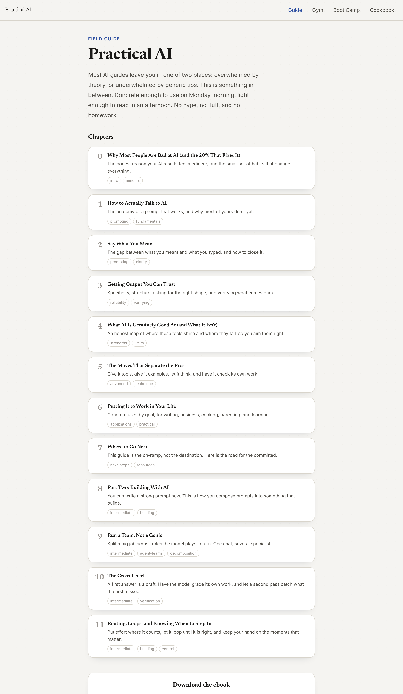
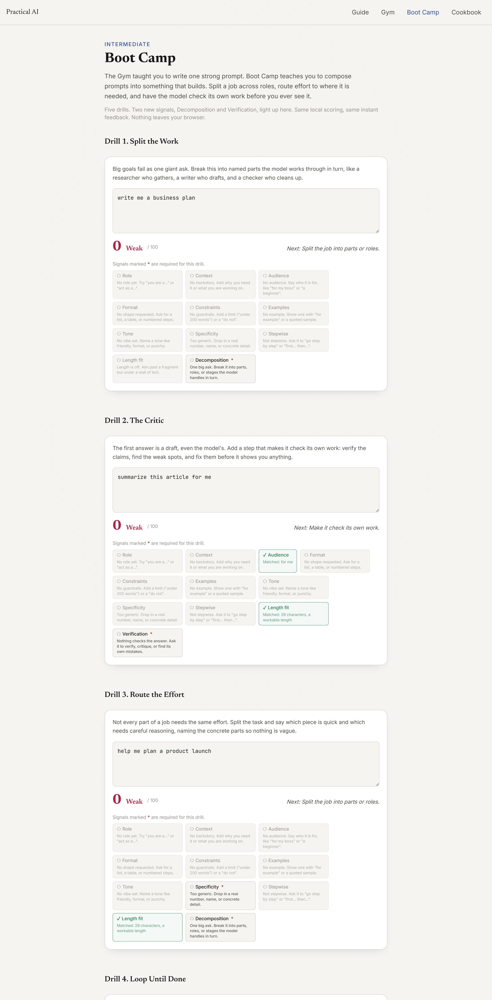

# Practical AI

**Get genuinely good at using AI, without wading through documentation.**

Most "get good at AI" material leaves you in one of two places: overwhelmed by theory, or
underwhelmed by generic tips. This is the thing in between. A short field guide you can read in an
afternoon, paired with hands-on drills that score your prompts as you type. Concrete enough to use on
Monday morning, light enough to actually finish.

<p align="center">
  
</p>

It ships as a static site with four surfaces:

- **Guide.** A read-it-through field guide in two parts. **Part One** takes you from stuck to fluent:
  how to talk to AI, say what you mean, get output you can trust, and the moves the pros lean on.
  **Part Two** is intermediate, about building with AI: splitting a job across roles, having the model
  check its own work, routing effort, and knowing when to step in.
- **Gym.** Short single-prompt drills with instant feedback. Each isolates one or two rubric signals
  (role, context, format, constraints, and so on) so you feel the difference one change makes.
- **Boot Camp.** The intermediate workout. Drills that grade composition, not just a single prompt:
  decomposition (split the work) and verification (check the work), plus capstones that combine them.
- **Cookbook.** A browsable library of real uses by everyday goal, each with a copy-able starter
  prompt, including a `building` section for the Part Two patterns.

<p align="center">
  
</p>

## How it works

100% client-side. A deterministic **rubric engine** scores your prompts offline using heuristics, not a
model, so the whole thing ships as a static site, costs nothing, needs no API key, and works on a plane.
The Gym grades the ten core signals. Boot Camp adds two advanced signals (decomposition, verification)
that only count in its drills, so beginner scoring is unchanged.

## Run it

```bash
npm install
npm run dev          # serve locally
npm run build        # static build into dist/ (deployable to GitHub Pages)
npm test             # rubric engine unit tests
npm run gen-cookbook # regenerate content/cookbook.json from the generator
npm run epub         # build the downloadable epub from the chapters
```

## Content

- `content/chapters/*.md` — the guide, Markdown with a small frontmatter schema. Part One is chapters
  00 to 07, Part Two is 08 to 11. A line of only `::practice::` renders an inline scored drill.
- `content/cookbook.json` — generated by `scripts/gen-cookbook.mjs`. Edit the generator, not the JSON.

## Stack

Vite 8 · React 19 · TypeScript · Tailwind v4 (CSS-first theme) · react-router. No backend.

See [SPEC.md](SPEC.md) for the full design and [feature_list.json](feature_list.json) for the
acceptance checklist.
